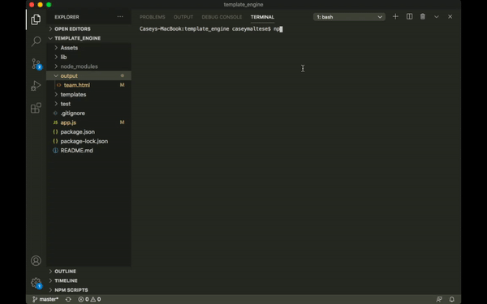
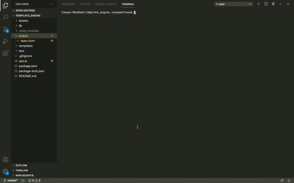
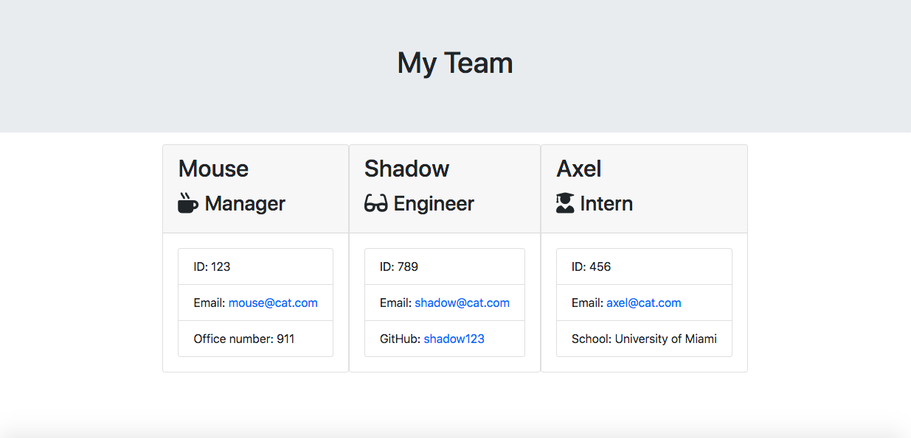

# template_engine
This template engine is an application that generates html files using input from a command-line interface. It is designed for the user to create a list of their employees including their names, roles, employee identification numbers, email addresses, and information specific to their respective roles.  This app was created using node.js and includes constructors and the prototype chain.  This app also employs the use of jest for test-driven development.   

Below you will find two gifs and an image.  The first gif demonstrates the functionality of the tests for this application.  The second gif demonstrates the functionality of the application itself.  The image shows the final html output generated by the user's input.

## GIF of npm run test:   

## GIF of node app.js:

## Image of team.html:
